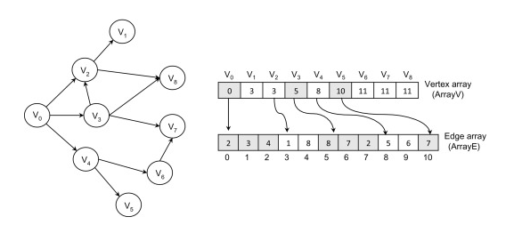

# Centrality Project

**Description:** CS 406 Project for Parallelizing Centrality Measurements: Degree 1&amp;2, Closeness and Betweenness Centralities

## Authors

- [Barış Batuhan Topal](https://github.com/barisbatuhan)

- [Çağhan Köksal](https://github.com/caghankoksal)

- [Furkan Ergün](https://github.com/furkaneergun)

- [Hakan Ogan Alpar](https://github.com/oalpar)

## Requirements

For GPU Code:

- CUDA 10.0
- gcc 5.3.0

For CPU Code:

- gcc 8.2.0

This implementation is tested on a HPC cluster running CentOS 6.5 and having 60 Intel(R) Xeon(R) E7-4870 v2 @ 2.30GHz as CPU and 12 GB Nvidia Tesla K40c as GPU with 2880 CUDA cores.

## Compilation & Run

- **CPU:** Includes a coarse-grained parallelization implementation using OpenMP. To run, either the `Makefile` inside the folder can be run or the command below can be executed: 

```
g++ ./ugraph.h main.cpp -O3 -fopenmp
./a.out <number_of_threads>
``` 

- **GPU:** Includes a hybrid parallelization approach based on both coarse grained and fine grained parallelization levels. To run, either the `Makefile` inside the folder can be run or the command below can be executed: 

```
nvcc -o cent_calc cent_gpu.cu
./cent_calc
```

**For both implementations**, the matrix file to run should be specified inside the main functions of the source codes. 

## Problem Statement

In today's world, graphs are being used widely in many different areas. For instance, while Google uses this data structure in “Google Maps” by representing the roads that connect different places as edges, Facebook analyzes their social network by representing each person as a vertex and their relations as edges [(Geeks For Geeks)](https://www.geeksforgeeks.org/applications-of-graph-data-structure/). Since graphs have a variety of use cases, measures and heuristics chosen to analyze these graph structures also vary. Programs and algorithms to analyze these graphs require lots of computation power. Moreover, because of the increasing data sizes, one may gain a significant time difference by parallelizing these heuristics.

We recognize that in the heart of most these network analysis are Breadth First Search (BFS), and if an end user decides to use different heuristics he or she would have to run multiple BFS algorithms to get the results for analysis. Our purpose is to unify multiple centrality measures under one program such that our program can give the results faster for cases where multiple centrality measures are queried and parallelize the overall ​BFS algorithm with the hope that it can give faster results for even a single centrality measure query. For this project, we specifically focus on the following centrality measures: degree 1&2 centrality, closeness centrality and betweenness centrality.

## Implementation

### Graph Representation

To narrow our problem space, in this project we only worked on undirected and unweighted sparse graphs. All these graphs are read and stored in [Compressed Sparse Row Representation (CSR)](https://www.researchgate.net/publication/324640550_A_survey_on_NoSQL_stores) to save space in sparse graphs. An example for CSR structure can be seen below [(Science Direct)](https://www.sciencedirect.com/topics/computer-science/graph-representation):



### Centrality Measurements

We chose 4 different centrality measurements, which are using BFS structure during the calculation. By using the same BFS result for each of the solution, calculating all these 4 heuristics in a shorter time is aimed. 

#### Degree One Centrality

For every single node, the number of links held by this node is calculated.

#### Degree Two Centrality

For all vertices, the number of their neighbors and their neighbors’ neighbors is found. In other words, for every single vertex, Breadth-First Search (BFS) algorithm is run and the total count of nodes is computed, which has a distance closer than or equal to 2.


#### Closeness Centrality

The closeness of each node to other nodes is found by running BFS and adding all the distances found as a result.


#### Betweenness Centrality

Measures the number of shortest paths between 2 different nodes (s and t), in which our vertex (v) lies on. The more our node is between these 2 other nodes, the higher will be the value for our node. The shortest paths between 2 nodes are determined by BFS algorithms.


### CPU Level Parallelization

*TO BE FILLED*

### GPU Level Parallelization

*TO BE FILLED*

## Results & Discussion

To measure our performance, four graphs with different sizes are being used, which are retrieved from [Suite-Sparse Matrix Collection](http://faculty.cse.tamu.edu/davis/suitesparse.html):

|  | **494_bus.mtx** | **c-43.mtx** | **wing_nodal.mtx** | **wave.mtx** |
| :--- | :---: | :---: | :---: | :---: |
| **Number Of Nodes** | 494 | 11125 | 10937 | 156317 |
| **Number of Edges** | 1080 | 67400 | 75488 | 1059331 |

Since there is no work calculating all of these 4 centrality measurements at the same time, our results are compared with a [betweenness centrality implementation having CUDA GPU parallelization](https://github.com/pvgupta24/Graph-Betweenness-Centrality), since betweenness centrality is the most time consuming measurement among all these selected. The implementation we have chosen for comparison is directly implementing the [methods presented by NVIDIA](https://devblogs.nvidia.com/accelerating-graph-betweenness-centrality-cuda/). Our results are stated below (The ones stated with italic fonts are from the repository we have used for comparison):

| **Methods** | **494_bus.mtx** | **c-43.mtx** | **wing_nodal.mtx** | **wave.mtx** |
| :--- | :---: | :---: | :---: | :---: |
| ***Brandes without Optimization*** | 60 ms | 57550 ms | 66500 ms | - |
| ***Brandes with -O3*** | 10 ms | 11370 ms | 20770 ms | 4915840 ms |
| **CPU 1 Thread** | 13.28 ms | 9881.95 ms | 25568.1 ms | 4578670 ms |
| **CPU 2 Threads** | 11.09 ms | 5240.38 ms | 13867.5 ms | 2343540 ms |
| **CPU 4 Threads** | 12.36 ms | 2927.2 ms | 7811.51 ms | 1198080 ms |
| **CPU 8 Threads** | 10 ms | 1639.76 ms | 4105 ms | 631664 ms |
| **CPU 16 Threads** | 9.88 ms | 926.6 ms | 2154.19 ms | 332555 ms |
| **CPU 32 Threads** | 8.78 ms | 525 ms | 1129.09 ms | 164977 ms |
| ***Edge Parallel GPU*** | 112 ms | 22757 ms | 99278 ms | - |
| ***Vertex Parallel GPU*** | 281 ms | 222499 ms | 128733 ms | - |
| ***Fine Grained GPU*** | 354 ms | 258352 ms | 79210 ms | - |
| ***Fine & Coarse Grained GPU*** | 61 ms | 17081 ms | 5448 ms | 1482232 ms |
| **Our GPU Implementation** | 16.55 ms | 20304.05 ms | 10377.41 ms | - |

*TO BE FILLED*

## Further Improvements

*TO BE FILLED*


