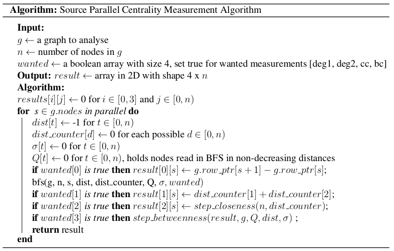
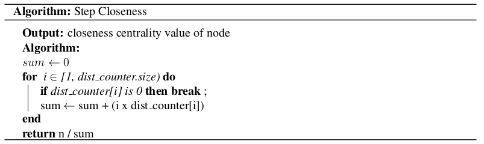

# CPU and GPU Parallelization on Graph Centrality Measures

**Description:** A Project for Parallelizing Centrality Measurements: Degree 1&amp;2, Closeness and Betweenness Centralities

## Authors

- [Barış Batuhan Topal](https://github.com/barisbatuhan)

- [Çağhan Köksal](https://github.com/caghankoksal)

- [Furkan Ergün](https://github.com/furkaneergun)

- [Hakan Ogan Alpar](https://github.com/oalpar)

## Requirements

For GPU Code:

- CUDA 10.0
- gcc 5.3.0

For CPU Code:

- gcc 8.2.0

This implementation is tested on a HPC cluster running CentOS 6.5 and having 60 Intel(R) Xeon(R) E7-4870 v2 @ 2.30GHz as CPU and 12 GB Nvidia Tesla K40c as GPU with 2880 CUDA cores.

## Compilation & Run

- **CPU:** Includes a coarse-grained parallelization implementation using OpenMP. To run, either the `Makefile` inside the folder can be run or the command below can be executed: 

```
g++ ./ugraph.h main.cpp -O3 -fopenmp
./a.out <number_of_threads>
``` 

- **GPU:** Includes a hybrid parallelization approach based on both coarse grained and fine grained parallelization levels. To run, either the `Makefile` inside the folder can be run or the command below can be executed: 

```
nvcc -o cent_calc cent_gpu.cu
./cent_calc
```

**For both implementations**, the matrix file to run should be specified inside the main functions of the source codes. 

## Problem Statement

In today's world, graphs are being used widely in many different areas. For instance, while Google uses this data structure in “Google Maps” by representing the roads that connect different places as edges, Facebook analyzes their social network by representing each person as a vertex and their relations as edges [(Geeks For Geeks)](https://www.geeksforgeeks.org/applications-of-graph-data-structure/). Since graphs have a variety of use cases, measures and heuristics chosen to analyze these graph structures also vary. Programs and algorithms to analyze these graphs require lots of computation power. Moreover, because of the increasing data sizes, one may gain a significant time difference by parallelizing these heuristics.

We recognize that in the heart of most these network analysis are Breadth First Search (BFS), and if an end user decides to use different heuristics he or she would have to run multiple BFS algorithms to get the results for analysis. Our purpose is to unify multiple centrality measures under one program such that our program can give the results faster for cases where multiple centrality measures are queried and parallelize the overall ​BFS algorithm with the hope that it can give faster results for even a single centrality measure query. For this project, we specifically focus on the following centrality measures: degree 1&2 centrality, closeness centrality and betweenness centrality.

## Implementation

### Graph Representation

To narrow our problem space, in this project we only worked on undirected and unweighted sparse graphs. All these graphs are read and stored in [Compressed Sparse Row Representation (CSR)](https://www.researchgate.net/publication/324640550_A_survey_on_NoSQL_stores) to save space in sparse graphs. An example for CSR structure can be seen below [(Science Direct)](https://www.sciencedirect.com/topics/computer-science/graph-representation):


### Centrality Measurements

We chose 4 different centrality measurements, which are using BFS structure during the calculation. By using the same BFS result for each of the solution, calculating all these 4 heuristics in a shorter time is aimed. 

#### Degree One Centrality

For every single node, the number of links held by this node is calculated.

#### Degree Two Centrality

For all vertices, the number of their neighbors and their neighbors’ neighbors is found. In other words, for every single vertex, Breadth-First Search (BFS) algorithm is run and the total count of nodes is computed, which has a distance closer than or equal to 2.


#### Closeness Centrality

The closeness of each node to other nodes is found by running BFS and adding all the distances found as a result.


#### Betweenness Centrality

Measures the number of shortest paths between 2 different nodes (s and t), in which our vertex (v) lies on. The more our node is between these 2 other nodes, the higher will be the value for our node. The shortest paths between 2 nodes are determined by BFS algorithms.


### Construction of the First Algorithm

In this project, several centrality measures are aimed to be calculated, while betweenness centrality is being measured.  Since the graphs are stored in the CSR form, degree one centrality can be easily calculated for each source node in O(1) time. However, for the other centrality measurements, BFS results for each vertex are needed. Our motivation is to use the results of the BFS algorithms for other centrality measurements, while calculating them for betweenness centrality. 

While general formulas are implemented for calculating closeness, degree 1, and degree 2 centralities, [the Brandes’ algorithm](https://www.eecs.wsu.edu/~assefaw/CptS580-06/papers/brandes01centrality.pdf) is used for calculating betweenness centrality, since the Brandes’ algorithm provides a lower complexity O(mn) than the general naive approach which has O( N^3 ). The pseudocode for this algorithm is: 


In the Brandes algorithm, creation of the predecessor array and 2 different parameters as queue and stack causes unnecessary memory writing and deleting operations. Only one array Q is created for both queueing and stacking processes and instead of the predecessor array, distance check of the neighbors of each node in Q is preferred in the betweenness step.  To decrease the total execution time, changing sizes of the vectors is avoided. In the C++ implementation, all vector parameters are initialized with a predetermined size and their sizes are not updated during the whole process. 
As mentioned before all other centrality measures can be calculated using the intermediate results to calculate the betweenness centrality because all of them rely on BFS and CSR graph representation. This results in the following code structure: Calculate degree one centrality by looking at the row indices of the graph, then running BFS, and using the result to calculate degree two, closeness, and betweenness centralities.



For BFS a top-down approach is used because of its ease of implementation. A variable dist_counter is used to calculate the degree two centrality while 2 more parameters are passed to the BFS function, namely Q and sigma. While Q holds the visited order of nodes with non-decreasing distance values, sigma holds the number of shortest paths from the source vertex to another selected vertex. BFS implementation is as follows:


Closeness centrality is also implemented as stated below. Since the number of vertices for each single distance is calculated beforehand, the complexity for calculating closeness values is decreased from O(n) to O(max_distance).
 


For betweenness, the approach of Brandes is followed. For each vertex in Q, an addition to the result is made. Since the calculation runs in parallel, this update is made atomically.


### CPU Level Parallelization

In order to calculate the betweenness centrality of each vertex in the graph, we need to apply the BFS algorithm to calculate the sigma and delta values of the corresponding vertex. Since all the computations BFS iterations for each source vertex are independent of each other, we have used coarse-grained parallelism by assigning each BFS iterations for each source to available threads.  By using this approach, Decreasing communication and synchronization overhead between threads is aimed. Moreover, even though a coarse-grained approach may cause workload imbalance between threads; in our approach since each thread will visit an equal number of nodes, the amount of work required for each thread is rather balanced. In addition to that, coarse-grained parallelism has physical memory constraints with the increasing number of threads. However, the physical memory problem is not confronted with any of the graphs that have been tested.

Also, we have tried fine-grained parallelism focusing on parallelizing processes for every single source vertex calculation. However, run-times that we have achieved are much worse than the coarse-grained approach; therefore, the coarse-grained approach is chosen as a parallelism approach.


### GPU Level Parallelization

For the GPU parallelization phase, our previous code designed for coarse-grained CPU parallelization was not suitable, since that structure includes a queue logic that has to be synchronized. Therefore, an implementation without any queue logic and with the least amount of synchronization and atomic operations is aimed. 

In the literature, there are some approaches [(Sarıyüce et. al., 2015)](https://www.sciencedirect.com/science/article/abs/pii/S0743731514001282?via%3Dihub) which succeeds to apply both coarse and fine-grained levels of parallelization to betweenness centrality. Thus, we have also designed a method, which benefits from both levels. As suggested in [a GitHub repository implementing betweenness centrality](https://github.com/pvgupta24/Graph-Betweenness-Centrality), each GPU block in our code is responsible for the calculation of centrality measurements of one source vector at a time, while every single thread in a block runs a part of inner processes for each source node.  In other words, with each block, a coarse-grained design is accomplished and with every thread group per block, fine-grained parallelization is succeeded. Pseudocode for our implementation can be reached below:


For simplicity, dist, sigma, and delta arrays are shown as they are created for each source vertex again. However, in the actual implementation, they are created at once for every single block running at the same time. 

The general algorithm can be summarized in 3 different parts:

#### BFS

In order to be freed from the queue structure previously used in the CPU code and to prevent write operations for each thread to the same location, a bottom-up BFS is chosen to be implemented. Each thread in the same block corresponds to a node (or group of nodes depending on the size of the graph given) and these nodes’ predecessors having a specific distance level are searched at each depth. After finding the predecessors, the sigma and distance values of the nodes are updated regarding the previous distance values of nodes. At the end of each loop, the level value is increased and the threads are synchronized.

#### Calculation of Closeness and Distance 2 Centralities

After BFS, each of the distance array values is traversed. By adding all the distances the closeness centrality value, and by counting nodes having a distance smaller than or equal to 2 the distance 2 centrality value is calculated for the selected source vertex.

#### Reverse Traverse

A similar fine-grained approach to BFS is also used for this step. Each thread in the same block corresponds to a node (or group of nodes depending on the size of the graph given) and starting from the nodes having the most distance level, delta, and betweenness centrality of the vertices are updated. At the end of each loop, the threads are synchronized and the level value is decreased by one until its value becomes zero.

## Results & Discussion

To measure our performance, four graphs with different sizes are being used, which are retrieved from [Suite-Sparse Matrix Collection](http://faculty.cse.tamu.edu/davis/suitesparse.html):

|  | **494_bus.mtx** | **c-43.mtx** | **wing_nodal.mtx** | **wave.mtx** |
| :--- | :---: | :---: | :---: | :---: |
| **Number Of Nodes** | 494 | 11125 | 10937 | 156317 |
| **Number of Edges** | 1080 | 67400 | 75488 | 1059331 |

Since there is no work calculating all of these 4 centrality measurements at the same time, our results are compared with a [betweenness centrality implementation having CUDA GPU parallelization](https://github.com/pvgupta24/Graph-Betweenness-Centrality), since betweenness centrality is the most time consuming measurement among all these selected. The implementation we have chosen for comparison is directly implementing the [methods presented by NVIDIA](https://devblogs.nvidia.com/accelerating-graph-betweenness-centrality-cuda/). Our results are stated below (The ones stated with italic fonts are from the repository we have used for comparison):

| **Methods** | **494_bus.mtx** | **c-43.mtx** | **wing_nodal.mtx** | **wave.mtx** |
| :--- | ---: | ---: | ---: | ---: |
| ***Brandes without Optimization*** | 0.060 s | 57.550 s | 66.500 s | - |
| ***Brandes with -O3*** | 0.010 s | 11.370 s | 20.770 s | 4915.840 s |
| **CPU 1 Thread** | 0.013 s | 9.882 s | 25.568 s | 4578.670 s |
| **CPU 2 Threads** | 0.011 s | 5.240 s | 13.867 s | 2343.540 s |
| **CPU 4 Threads** | 0.012 s | 2.927 s | 7.812 s | 1198.080 s |
| **CPU 8 Threads** | 0.010 s | 1.640 s | 4.105 s | 631.664 s |
| **CPU 16 Threads** | 0.009 s | 0.926 s | 2.154 s | 332.555 s |
| **CPU 32 Threads** | 0.008 s | 0.525 s | 1.129 s | 164.977 s |
| ***Edge Parallel GPU*** | 0.112 s | 22.757 s | 99.278 s | - |
| ***Vertex Parallel GPU*** | 0.281 s | 222.499 s | 128.733 s | - |
| ***Fine Grained GPU*** | 0.354 s | 258.352 s | 79.210 s | - |
| ***Fine & Coarse Grained GPU*** | 0.061 s | 17.081 s | 5.448 s | 1482.232 s |
| **Our GPU Implementation** | 0.036 s | 25.807 s | 20.890 s | 3938.688 s |

**Note:** All of the methods listed in the table are tested on the same HPC cluster mentioned in the *Requirements* section.

A comparison of the speedups of some of the methods given above:


### CPU

As far as CPU parallelization is considered, our algorithm has almost linear speed up on medium and large graphs whereas, on small graphs, speed up stays sub-linear. While calculating betweenness centrality, at each iteration threads update the result vector, which is shared among all threads. In order to avoid mutual exclusion, updates occur in an atomic manner and since the number of nodes in small graphs are fewer, updates occur more frequently and threads wait for each other which prohibits expected speed-up on small graphs. Likewise, because of the mutual exclusion, efficiency also decreases, if the size of the graph also decreases.
Furthermore, it should be noted that CPU implementation shows strong scaling as the coarse-grained approach is implemented.

### GPU

For the GPU parallelization, as mentioned before, the code is compared against a GitHub repository that implements NVIDIA’s methods. As the results above demonstrate, the GPU implementation runs faster than Edge Parallel GPU, Vertex Parallel GPU, Fine-Grained GPU implementations. The approach fails only against Fine & Coarse-Grained GPU implementation in larger graphs that have more than approximately 104 nodes. It should also be noted that our GPU implementation also follows a coarse-grained manner in order to achieve strong scaling. Furthermore, it is clear both the implementation does not perform any better than CPU parallelization. Therefore, it may be argued that the  problem does not suit GPU parallelization as better as CPU parallelization as it requires a lot of synchronization. 

It should also be noted that the approach calculates the Degree Centrality, Degree 2 Centrality and Closeness Centrality along the way of calculating the Betweenness Centrality. In other words, the speed up also contains the other three centrality metrics as an extra.

## Further Improvements

In our current implementation, only one GPU is used to calculate a solution to the problem. Therefore the GPU code is not fit to be used by multiple GPUs. In the future, code can be altered to work on multiple GPUs and be more efficient. 

Also currently, our centrality computation exploits a vertex-based parallelization. There is a more efficient way to parallelize these centrality measures called [virtual-vertex-based parallelization](https://www.sciencedirect.com/science/article/abs/pii/S0743731514001282?via%3Dihub). Latter method can be exploited in the future to speed up. Furthermore, we are using a bottom-up approach on our BFS parallelization, yet there are hybrid algorithms that combine the bottom-up approach and top-down approach to abuse the efficiency of both algorithms. In the future, a hybrid BFS algorithm can be implemented. 

Finally, we have two different implementations for centrality measures, one on the GPU and one on the CPU, in the future these two implementations can be combined to calculate the result for our problem more efficiently.


